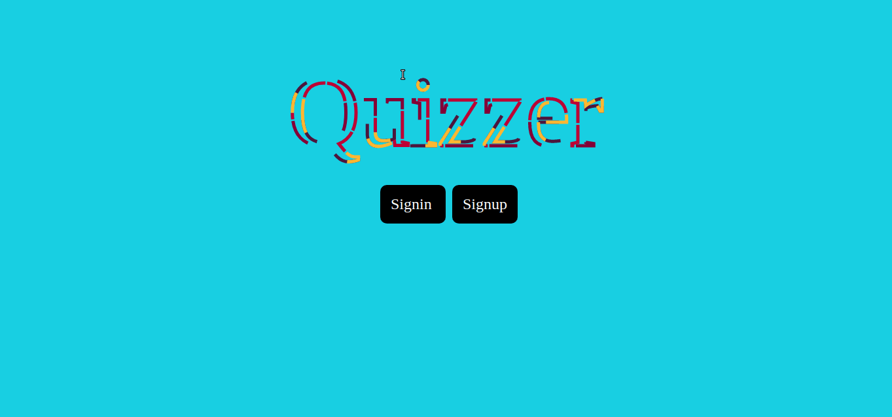
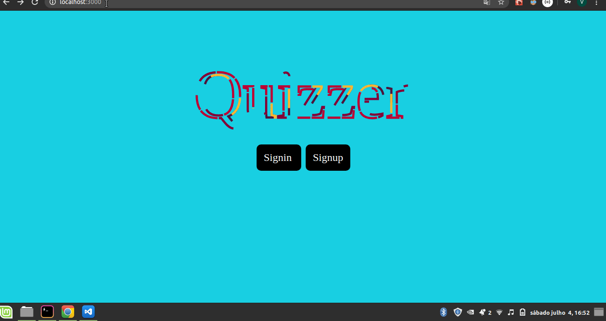
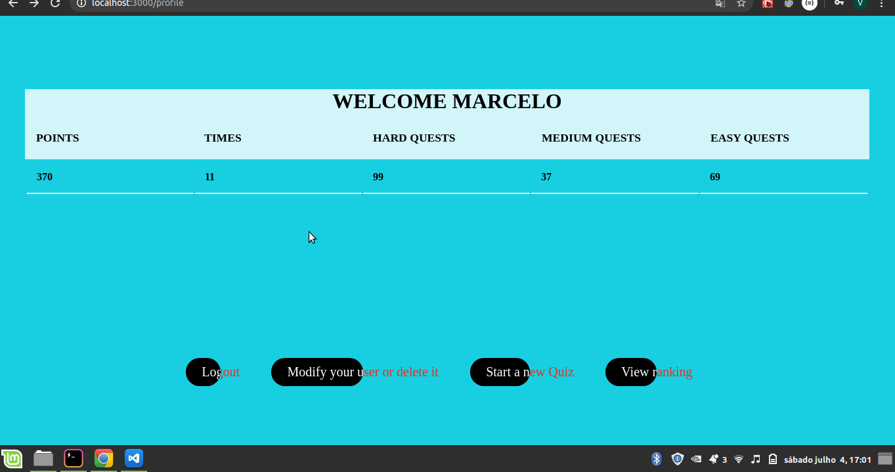
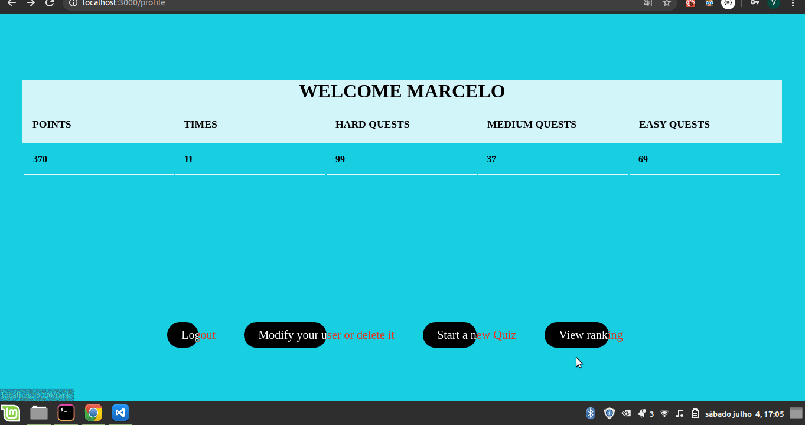

# Bem vindo ao Quizzer. 

### Este é um app para passar o tempo respondendo perguntas de diversas categorias e dificuldades.

#### Tecnologias usadas : 
> - Typescript para tudo, tanto frontend quando backend,
> - TypeOrm para integração com o banco de dados,
> - Bcrypt para criptografar as senhas dos usuários,
> - Jwt para autenticação jwt,
> - Eslint e Prettier para a padronização do codigo, 
> - Styled-components para estilização,
> - Axios para chamadas as Api's, 
> - React-router-dom e react-transition-group para as rotas,
> - Font-awesome para algumas icones.

###### Como instalar

- Primeiro faça um clone desse repositório com *git clone https://github.com/viniciu21/Quizzer.git* ou baixe o arquivo zipado. 

- Depois vá para a pasta backend e execute o comando *npm i*, em seguida, execute o mesmo comando agora na pasta frontend.

- Após isso, veja se você tem instalado em sua maquina algum tipo de banco relacional, se não tiver, recomendo que instale para que o app funcione. 

- Recomendo usar o postgress, pois foi o mesmo que eu usei para os testes e confecção deste app. 

- Logo após isso, va no arquivo /backend/ormconfig.json e mude as seguintes propriedes: type, port, username e password para as do seu banco de dados, para bancos sem ser o postgress, recomendo que veja a doc do typeorm em https://typeorm.io/#/connection-api.

- Após fazer isso, execute na pasta backend o comendo *npm run dev* ou *yarn dev* e na pasta frontend *npm start* ou *yarn start*.

- Se tudo estiver correto, seu navegador abrira na porta local 3000 e você poderá desfrutar do app.

Porêm, se quiser apenas ver o app, vou por alguns Gifs dele em uso por mim.

> Me desculpem a qualidade dos gifs mas eu nãp consegui deixar melhor que isso.  

Primeiro vem a tela inicial: 

Agora, as telas de login e logout: 

> Note que existe uma segurança nas páginas, apenas usuárioslogados podem acessar-las.

Vamos ver os ranks, populados pelos usuários que eu criei: 

> Note que existem 3 tipos de ranks, tem o podium com os usuários que acertaram o maior número de questões por nivel (hard, medium e easy), a classificação dos usuários por numero de pontos e a classificação do por menor tempo medio de respostas.

Podemos modificar ou deletar o usuário:

E a cereja do bolo, o quiz: 

> Note que podemos ou não por as categorias do quiz, sua dificuldade ou os tipos de questões, e que, quando salvar-mos, a tabela na pagina /profile vai mudar seus valores assim como no rank. 

> O gif cortou o botão de salvar mas ele existe.

Email para contato: viniciusoliveiras12@hotmail.com.br.